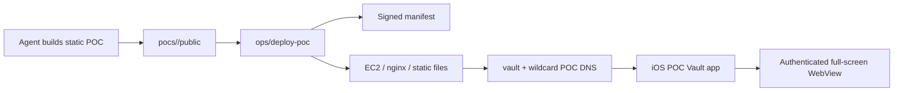

# Private iOS POC Vault

Private iPhone-first hosting for AI-generated frontend POCs.

The idea is simple: agents can keep producing static demos, but the user sees
them as a private native library on iPhone. Each demo is just HTML/CSS/JS hosted
behind mutual TLS. The iOS app fetches a signed manifest, shows the list of
available POCs, and opens each one in an authenticated full-screen WebView.

No app update is required when a new POC is added.

## What This Solves

When agents create quick prototypes, they often end up scattered across local
folders, temporary localhost ports, screenshots, or ad-hoc deploys. POC Vault
turns that into a repeatable loop:

1. An agent builds a static POC.
2. The deploy script publishes it to a private VM.
3. The manifest is regenerated and signed.
4. The iPhone app refreshes and shows the new POC.
5. The POC opens in a full-screen authenticated WebView.

The app is deliberately boring and stable. The experiments live on the backend.

## Architecture



Core pieces:

- `pocs/<slug>/public/**`: static POC assets.
- `pocs/<slug>/poc.json`: POC metadata shown in the iOS library.
- `ops/deploy-poc`: validates, stages, signs, deploys, and logs.
- `build/manifest.json`: generated POC registry.
- `build/manifest.sig.json`: Ed25519 signature sidecar.
- `ios/POCVault/`: SwiftUI app that reads the manifest and opens POCs.
- nginx mTLS: blocks clients without a valid client certificate.

## Security Model

POC Vault is private by default.

- Public DNS can point to the VM.
- HTTPS can be open to the internet on port 443.
- nginx requires a valid client certificate for `/manifest.json` and POC pages.
- `/healthz` is intentionally public for diagnostics.
- The iOS app verifies the manifest signature before trusting entries.
- Secrets live outside the repo under `~/.poc-vault/secrets`.

Important distinction: access is currently limited to holders of a valid client
certificate. It is not hardware-bound to one iPhone unless the certificate is
generated and kept only on that device.

Never commit:

- `.p12`, `.pem`, `.key`, `.crt`, `.csr`, `.mobileconfig`
- AWS credentials or Route53 hosted-zone secrets
- client CA keys
- manifest signing private keys
- local config files from `~/.poc-vault/secrets`

## Backend-Driven Contract

Adding, replacing, hiding, or updating a POC must not require an iOS app change.
The iOS app is only a signed-manifest client and authenticated WebView shell.

For normal POC work, change only:

- `pocs/<slug>/poc.json`
- `pocs/<slug>/public/**`
- generated `build/manifest.json` and `build/manifest.sig.json`
- live files under the configured server root via `ops/deploy-poc`

Change `ios/POCVault/` only for vault-app features, identity/enrollment changes,
manifest schema changes, signing/project settings, or security behavior.

## Deployment Configuration

This repository ships with example domains only. Real deployment values should
live outside git in `~/.poc-vault/secrets/config.env`.

- Region: `ap-south-1` by default, configurable with `AWS_REGION`
- Vault host: configured with `VAULT_DOMAIN`
- POC host pattern: configured with `POC_WILDCARD_DOMAIN`
- Server root: `/srv/poc-vault`
- Deploy user: `deploy`

Do not copy local secret values into this repository.

## Setup

Install local prerequisites:

- macOS with Xcode for iOS builds
- Python 3
- `rsync`
- AWS CLI if provisioning or managing the EC2/Route53 pieces
- `openssl`

Create local secrets/config:

```bash
mkdir -p ~/.poc-vault/secrets
cp ops/config.example.env ~/.poc-vault/secrets/config.env
```

Edit `~/.poc-vault/secrets/config.env` with your own values. Keep that file
outside git.

Typical config keys:

```bash
AWS_REGION=ap-south-1
DOMAIN_ROOT=example.com
VAULT_DOMAIN=vault.pocs.example.com
POC_WILDCARD_DOMAIN=*.pocs.example.com
DEPLOY_HOST=
DEPLOY_USER=deploy
SERVER_ROOT=/srv/poc-vault
KEY_PATH=$HOME/.poc-vault/secrets/ssh/poc-vault.pem
CLIENT_CERT_DAYS=90
```

## Deploy A POC

Build any static frontend that has an `index.html`, then run:

```bash
ops/deploy-poc \
  --slug example-poc \
  --title "Example POC" \
  --description "Internal demo for the iOS vault" \
  --source /path/to/static-build \
  --force
```

The command:

- validates the slug and source
- writes/updates `pocs/<slug>/poc.json`
- copies assets to `pocs/<slug>/public/`
- renders `build/manifest.json`
- signs `build/manifest.sig.json` when the local signing key exists
- appends one JSON line to local `ops/deploys.log`
- rsyncs to the VM when `DEPLOY_HOST` is configured

Use `--local-only` for a dry run that does not touch the VM:

```bash
ops/deploy-poc \
  --slug example-poc \
  --title "Example POC" \
  --description "Local test" \
  --source /path/to/static-build \
  --force \
  --local-only
```

Live URL shape:

```text
https://<slug>.pocs.example.com/
```

## Manifest And Signing

Render the manifest locally:

```bash
python3 ops/render-manifest.py --pocs-dir pocs -o build/manifest.json
```

Sign it:

```bash
python3 ops/sign-manifest.py build/manifest.json --allow-missing-key
```

Default signing key path:

```text
~/.poc-vault/secrets/signing/manifest-ed25519.key
```

Supported key formats are PEM/OpenSSH Ed25519 private keys, raw 32-byte hex, and
raw 32-byte base64/base64url.

## iOS App

The app has two jobs:

- show the signed manifest as a native private library
- open each POC URL in an authenticated `WKWebView`

POC detail screens are full-screen. There is no standard navigation bar above
hosted pages. The shell uses a small translucent floating back button over the
WebView; it dims while scrolling and returns after scrolling settles.

The app must not hardcode individual POCs. Every POC comes from the manifest.

Open the project:

```bash
open ios/POCVault/POCVault.xcodeproj
```

Build from CLI for a connected device when signing is configured:

```bash
xcodebuild build \
  -project ios/POCVault/POCVault.xcodeproj \
  -target POCVault \
  -configuration Debug \
  -destination 'id=<device-id>' \
  -allowProvisioningUpdates
```

## iPhone Certificate Provisioning

The production app needs a client certificate before it can load the manifest or
POC pages.

Current import flow:

1. Place `client.p12` in the app container at `Documents/support/client.p12`.
2. Optionally place `vault-config.json` in the same support directory when the
   production manifest URLs should come from local config instead of Xcode build
   settings.
3. Open the app's Diagnostics screen.
4. Enter the passphrase from `IPHONE_P12_PASSWORD` in local config.
5. Tap `Import Certificate`.
6. Confirm `Keychain identity` turns green.
7. Return to Library and refresh.

Support config shape:

```json
{
  "manifestURL": "https://vault.pocs.example.com/manifest.json",
  "signatureURL": "https://vault.pocs.example.com/manifest.sig.json"
}
```

Provision a connected iPhone with `devicectl`:

```bash
DEVICE=<device-id>
ops/provision-ios-support.sh --device "$DEVICE"
```

Open Diagnostics once before copying if the support directory has not been
created yet.

Check that the file is visible to the app:

```bash
xcrun devicectl device info files \
  --device "$DEVICE" \
  --domain-type appDataContainer \
  --domain-identifier "$BUNDLE" \
  --subdirectory Documents \
  --recurse \
  --timeout 30
```

## Simulator Preview

Simulator builds use a local signed preview vault instead of production mTLS:

- manifest: `http://127.0.0.1:8787/manifest.json`
- signature: `http://127.0.0.1:8787/manifest.sig.json`
- POCs: `http://127.0.0.1:8787/pocs/<slug>/`

Launch:

```bash
ios/launch-simulator.sh
```

That script starts `ops/serve-simulator-poc-vault` in a detached `screen`
session if needed, builds the simulator app, installs it, and launches it.

Health check:

```bash
curl -fsS http://127.0.0.1:8787/healthz
```

## Repository Layout

```text
.
├── AGENTS.md
├── README.md
├── SECURITY.md
├── ios/
│   ├── launch-simulator.sh
│   └── POCVault/
├── ops/
│   ├── config.example.env
│   ├── deploy-poc
│   ├── install-server.sh
│   ├── provision-ec2.sh
│   ├── render-manifest.py
│   ├── serve-simulator-poc-vault
│   └── sign-manifest.py
└── pocs/
    └── smoke-test/
```

## Verification

Local checks:

```bash
python3 -m py_compile ops/render-manifest.py ops/sign-manifest.py ops/deploy-poc ops/serve-simulator-poc-vault
bash -n ios/launch-simulator.sh
python3 ops/render-manifest.py --pocs-dir pocs -o build/manifest.json
python3 ops/sign-manifest.py build/manifest.json --allow-missing-key
```

Live checks for a configured private instance:

```bash
ops/verify-server.sh
```

If local DNS is stale, pass the VM IP at runtime without putting it in git:

```bash
ops/verify-server.sh --resolve-ip <vm-public-ip>
```

The manifest and POC page should be blocked without a client cert and return
`200` with the configured client certificate.

## Operational Notes

- `ops/deploys.log` is local append-only evidence of deployments and is ignored
  by git because it can contain machine-specific source paths.
- `ops/deploys.example.log` shows the log shape.
- Client certs are short-lived; renew/re-provision before expiry.
- If the iPhone app cannot load POCs, check Diagnostics first.
- If the simulator works but the phone does not, suspect certificate import or
  provisioning before changing the backend.
- Keep future POCs static unless the user explicitly accepts backend scope.
