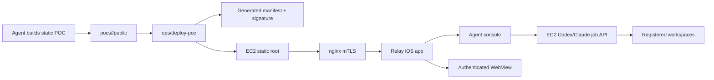

# Relay

Relay is a private, iPhone-first control surface for remote AI agent work and
authenticated internal demos. From the phone, it can browse signed static POCs,
start and continue Codex or Claude runs on EC2, review bounded thread output,
and send spoken prompts through the protected agent API.

The repository and backend still use the older POC Vault naming in internal
places. Treat POC Vault as the static-hosting and legacy platform vocabulary,
not the full product identity.

The project has four core ideas:

- Relay is the phone control surface for remote agent work.
- POCs are backend-driven static assets. A new demo should not require an app release.
- Access is private by default. Manifest files, POC pages, and the Codex job API
  sit behind mutual TLS.
- Agent runs happen on registered EC2 workspaces, not arbitrary phone-supplied paths.

## What This Project Delivers

| Area | Capability |
| --- | --- |
| Private POC hosting | Static HTML/CSS/JS demos live under `pocs/<slug>/public/` and are served through nginx. |
| Signed discovery | `build/manifest.json` is generated from source metadata and signed with an Ed25519 sidecar. |
| Relay iOS app | SwiftUI app presents the agent console, private POC library, diagnostics, and authenticated WebViews. |
| One-command deploys | `ops/deploy-poc` validates, stages, signs, logs, rsyncs, and promotes POCs to the VM. |
| Local simulator mode | Simulator builds use a local signed vault on `127.0.0.1:8787` instead of production mTLS. |
| Remote agent control | The agent console talks to an EC2-side async Codex/Claude job API for registered workspaces. |
| Operational hardening | Secrets stay outside git, protected routes require client certificates, and verification scripts check the live perimeter. |

The result is a private mobile workflow: start or continue remote agent work,
review results from the phone, and open deployed internal demos without changing
native code for each POC.

## Branding

- User-facing app name: `Relay`.
- Use `Relay` for app icons, logos, UI copy, App Store-style text, screenshots,
  onboarding, and visual design work.
- Treat `POC Vault`, `POCVault`, `poc-vault`, and `com.parikshit.pocvault` as
  internal or legacy names for the repo, Xcode project, Swift module, bundle id,
  backend workspace, and manifest/config vocabulary.
- Do not use vault-door, keyhole, safe, lockbox, or storage metaphors for the
  app logo or product visuals unless that direction is explicitly requested.
- Do not rename internal identifiers just to match the Relay brand. The bundle
  id, module, target, repo path, backend config keys, and workspace names stay
  stable unless a deeper rename is requested.
- The current icon source lives at
  `ios/POCVault/POCVault/Resources/AppIcon/relay-logo.svg`; generated app-icon
  PNGs live in the AppIcon resource folders, while Xcode build output stays
  ignored.

## Architecture


```mermaid
flowchart LR
  Phone["Relay iOS app"] --> AgentConsole["Agent console"]
  AgentConsole --> CodexAPI["EC2 Codex/Claude job API"]
  CodexAPI --> Workspaces["Registered workspaces"]
  Agent["Agent builds static POC"] --> Source["pocs/<slug>/public"]
  Source --> Deploy["ops/deploy-poc"]
  Deploy --> Manifest["Generated manifest + signature"]
  Deploy --> VM["EC2 static root"]
  VM --> Nginx["nginx mTLS"]
  Nginx --> Phone
  Phone --> WebView["Authenticated WebView"]
```

### Repository Responsibilities

```text
.
├── pocs/                 # Source metadata and static POC assets
├── ops/                  # Deploy, signing, verification, cert, and server scripts
├── ios/POCVault/         # Native Relay iOS app; legacy internal path
├── codex-server/         # EC2 async Codex job API
├── build/                # Generated manifest and signature artifacts
├── README.md             # Project overview and operating guide
├── SECURITY.md           # Secret-handling and access-model notes
└── AGENTS.md             # Agent contract for this repository
```

## Backend-Driven POC Contract

Relay is not a hardcoded POC catalog. Adding, replacing, hiding, or updating a
POC should only touch backend-driven assets:

- `pocs/<slug>/poc.json`
- `pocs/<slug>/public/**`
- generated `build/manifest.json`
- generated `build/manifest.sig.json`
- remote files promoted by `ops/deploy-poc`

Do not edit `ios/POCVault/` for ordinary POC creation. Native changes are
reserved for Relay app behavior, enrollment/identity, manifest schema,
signing/project settings, agent console behavior, or security behavior.

Each deployable POC has:

```text
pocs/<slug>/
├── poc.json
└── public/
    └── index.html
```

Minimum metadata:

```json
{
  "slug": "example-poc",
  "title": "Example POC",
  "description": "Short sentence shown in the iOS library."
}
```

## Security Model

Relay's backend is designed so public DNS can point at the VM while protected
routes remain inaccessible to ordinary web clients.

- `/healthz` is intentionally public for diagnostics.
- `/manifest.json`, `/manifest.sig.json`, and POC pages require a valid client
  certificate.
- `/v1/codex/*` routes require mTLS and an allowlisted certificate subject.
- The iOS app verifies the manifest signature before trusting entries.
- Secrets live outside the repo under `~/.poc-vault/secrets`.

Important access wording: the perimeter is certificate-based. The live vault is
private to holders of valid client certificates; it is not hardware-bound to a
single iPhone unless the private key is generated and kept only on that device.

Never commit:

- `.p12`, `.pem`, `.key`, `.crt`, `.csr`, `.mobileconfig`
- AWS credentials or Route53 hosted-zone secrets
- client CA private keys
- client certificate private keys
- manifest signing private keys
- copied Codex auth JSON or API keys
- local config copied from `~/.poc-vault/secrets`

Read [SECURITY.md](SECURITY.md) before changing operational files or pushing.

## Current POC Catalog

| Slug | Purpose |
| --- | --- |
| `bmw-i7-m4-acceleration` | Interactive acceleration and distance-gap comparison for BMW i7 xDrive60 and BMW M4 Competition xDrive scenarios. |
| `india-ctc-calculator` | Mobile-first India salary reverse calculator for monthly in-hand targets. |
| `sfs-data-readiness` | Project Leap data-readiness workbench covering asks, source systems, schemas, owners, and a 30-day plan. |
| `sfs-leap-workbench` | Internal SFS Project Leap technical wave planning workbench. |
| `smoke-test` | Tiny static page used to verify deploy, manifest, and iOS loading. |

## Local Setup

Install prerequisites:

- macOS with Xcode for iOS builds
- Python 3
- `rsync`
- `openssl`
- AWS CLI for EC2 or Route53 provisioning work

Create local config outside git:

```bash
mkdir -p ~/.poc-vault/secrets
cp ops/config.example.env ~/.poc-vault/secrets/config.env
```

Fill in `~/.poc-vault/secrets/config.env` with local values. Example shape:

```bash
AWS_REGION=ap-south-1
DOMAIN_ROOT=example.com
VAULT_DOMAIN=vault.pocs.example.com
POC_WILDCARD_DOMAIN=*.pocs.example.com
CODEX_DOMAIN=codex.pocs.example.com
DEPLOY_HOST=
DEPLOY_USER=deploy
SERVER_ROOT=/srv/poc-vault
KEY_PATH=$HOME/.poc-vault/secrets/ssh/poc-vault.pem
CLIENT_CERT_DAYS=90
POC_VAULT_CODEX_BASE_URL=https://codex.pocs.example.com
POC_VAULT_MANIFEST_PUBLIC_KEY=
```

Do not copy real values from local config into this repository.

For a new owner or teammate installing against their own EC2/domain, start with:

```bash
ops/init-install-config --domain-root example.com --bundle-id com.parikshit.pocvault
```

Then follow [docs/MULTI_INSTALL.md](docs/MULTI_INSTALL.md). That flow keeps
AWS, DNS, certificate subjects, iOS bundle id, manifest signing key, and Codex
runtime config outside git while rendering install-specific nginx and systemd
environment files.

## Deploy A POC

Build or prepare any static frontend with an `index.html`, then run:

```bash
ops/deploy-poc \
  --slug example-poc \
  --title "Example POC" \
  --description "Internal demo for the iOS vault" \
  --source /path/to/static-build \
  --force
```

The deploy command:

1. validates the slug and source
2. writes or updates `pocs/<slug>/poc.json`
3. copies static assets into `pocs/<slug>/public/`
4. renders `build/manifest.json`
5. signs `build/manifest.sig.json` when the signing key exists
6. appends one JSON line to ignored `ops/deploys.log`
7. rsyncs and promotes files to the VM when `DEPLOY_HOST` is configured

For a local dry run:

```bash
ops/deploy-poc \
  --slug example-poc \
  --title "Example POC" \
  --description "Local test" \
  --source /path/to/static-build \
  --force \
  --local-only
```

Live POC URL shape:

```text
https://<slug>.<configured-poc-domain>/
```

## Manifest And Signing

Render the manifest:

```bash
python3 ops/render-manifest.py --pocs-dir pocs -o build/manifest.json
```

Sign it:

```bash
python3 ops/sign-manifest.py build/manifest.json --allow-missing-key
```

Default signing key path:

```text
~/.poc-vault/secrets/signing/manifest-ed25519.key
```

Supported private-key formats:

- PEM/OpenSSH Ed25519 private key
- raw 32-byte hex
- raw 32-byte base64 or base64url

If the signing key is missing, local preview workflows can continue with
`--allow-missing-key`. Production devices should receive both the manifest and
signature sidecar.

## iOS App

The iOS app is named Relay. It has four jobs:

1. start, continue, monitor, cancel, and review remote Codex/Claude agent runs
2. record spoken prompts and send them for authenticated transcription
3. load and verify the signed POC manifest
4. open POCs in an authenticated full-screen `WKWebView`

The current tab layout is **Library, Chat, Task, and Status**. Chat is the
synchronous streaming surface (Bedrock/Azure over SSE); Task is the asynchronous
Codex/Claude job runner with server-driven model and effort controls, live job
polling, and workspace-grouped threads; Status combines recent provider activity
with the Diagnostics health view. See [docs/CHAT_REDESIGN.md](docs/CHAT_REDESIGN.md)
for the chat-first redesign and current Task behavior.

The app intentionally does not know individual POCs at compile time. POC detail
screens have no standard navigation bar above hosted pages; the shell uses a
small translucent floating back button over the WebView.

Open the project:

```bash
open ios/POCVault/POCVault.xcodeproj
```

Build for a connected device when signing is configured:

```bash
xcodebuild build \
  -project ios/POCVault/POCVault.xcodeproj \
  -target POCVault \
  -configuration Debug \
  -destination 'id=<device-id>' \
  -allowProvisioningUpdates
```

## iPhone Certificate Provisioning

The production app needs a client certificate before it can load the manifest,
POC pages, or Codex API routes.

Current import flow:

1. Open Diagnostics once so the app creates its support directory.
2. Place `client.p12` at `Documents/support/client.p12` inside the app data
   container.
3. Optionally place `vault-config.json` in the same support directory.
4. Open Diagnostics.
5. Enter the passphrase from `IPHONE_P12_PASSWORD` in local config.
6. Tap `Import Certificate`.
7. Confirm `Keychain identity` is green.
8. Return to Library and refresh.

Support config shape:

```json
{
  "codexBaseURL": "https://codex.pocs.example.com",
  "manifestPublicKey": "<base64url-ed25519-public-key>",
  "manifestURL": "https://vault.pocs.example.com/manifest.json",
  "signatureURL": "https://vault.pocs.example.com/manifest.sig.json"
}
```

Provision a connected iPhone with `devicectl`:

```bash
DEVICE=<device-id>
ops/provision-ios-support.sh --device "$DEVICE"
```

Check that support files are visible to the app:

```bash
xcrun devicectl device info files \
  --device "$DEVICE" \
  --domain-type appDataContainer \
  --domain-identifier "$BUNDLE" \
  --subdirectory Documents \
  --recurse \
  --timeout 30
```

## Simulator Preview

Simulator builds use a local signed preview vault instead of production mTLS:

- manifest: `http://127.0.0.1:8787/manifest.json`
- signature: `http://127.0.0.1:8787/manifest.sig.json`
- POCs: `http://127.0.0.1:8787/pocs/<slug>/`

Launch:

```bash
ios/launch-simulator.sh
```

The script starts `ops/serve-simulator-poc-vault` in a detached `screen`
session if needed, builds the simulator app, installs it, and launches it.

Health check:

```bash
curl -fsS http://127.0.0.1:8787/healthz
```

## Agent Console

Relay includes an agent console for remote Codex and Claude work on EC2. The
server lives inside this repository because the iOS app, static POC host, and
runner API are deployed as one operational system.

Server workspace:

```text
codex-server/
```

Live API shape:

```text
https://<configured-codex-domain>/v1/codex/*
```

Current API behavior:

- `/v1/codex/*` is protected by mTLS.
- Allowed certificate subjects are configured per install with
  `CODEX_ALLOWED_CERT_SUBJECTS`.
- `/v1/codex/models` exposes the server-side model catalog so Relay does not
  compile model ids into the app. Task entries can include a public `taskModel`
  alias and supported effort levels.
- When `~/.config/opencode/opencode.jsonc` exists, the Codex API install config
  renders Relay's catalog from the local OpenCode Azure/Bedrock inventory.
- `/v1/codex/chat` streams synchronous Chat mode over SSE for Bedrock and Azure
  catalog entries.
- Jobs are async and persisted on the VM.
- Job history, detail logs, cancel, timeout, sessions, thread summaries, and
  bounded thread detail are supported.
- Provider-aware jobs are supported. `codex` is the default provider; `claude`
  is available when configured on the runner.
- Chat mode uses `bedrock` or `azure`; Task mode continues to use the existing
  async `codex` and `claude` job contracts.
- Relay polls active Task jobs while the Task tab is visible, renders completed
  job answers as Markdown, and groups task threads by workspace.
- Threads are provider-locked, so a Codex thread is resumed by Codex and a
  Claude thread is resumed by Claude. Relay also requires the selected workspace
  to match before sending a task `resumeSessionId`.
- Phone-recorded prompt audio can be transcribed through the authenticated
  Codex API when Azure Speech is configured on the server.
- Workspaces can be configured in `/etc/codex-api.env` or safely selected from
  directory listings under the configured EC2 workspace root; the phone still
  cannot request arbitrary filesystem paths.
- Successful answers with fenced code blocks can expose job-scoped artifacts
  for raw download or sandboxed preview. These artifacts are not added to the
  signed POC manifest unless they are separately deployed through
  `ops/deploy-poc`.

Seeded workspace ids:

```text
scratch
poc-vault
sigiq
```

For server-specific deployment and verification details, read
[codex-server/README.md](codex-server/README.md).

For a complete implementation walkthrough across Relay, the POC host, agent
console, transcription flow, security model, and verification commands,
read [docs/IMPLEMENTATION.md](docs/IMPLEMENTATION.md).

For the full project history and rationale behind the current architecture,
read [docs/PROJECT_HISTORY.md](docs/PROJECT_HISTORY.md).

## Verification

Run local checks after changing deploy tooling, metadata, signing, server code,
or app shell behavior:

```bash
python3 -m py_compile ops/render-manifest.py ops/sign-manifest.py ops/deploy-poc ops/serve-simulator-poc-vault
bash -n ios/launch-simulator.sh
python3 ops/render-manifest.py --pocs-dir pocs -o build/manifest.json
python3 ops/sign-manifest.py build/manifest.json --allow-missing-key
cd codex-server/codex-api-deploy && node --check server.mjs && node --test server.test.mjs
```

Live perimeter check for a configured instance:

```bash
ops/verify-server.sh
```

If local DNS is stale, pass the VM IP at runtime without writing it into git:

```bash
ops/verify-server.sh --resolve-ip <vm-public-ip>
```

Expected live behavior:

- protected manifest and POC routes are blocked without a client certificate
- protected manifest and POC routes return `200` with the configured client cert
- `/healthz` remains public
- Codex API health and job checks pass when Codex was touched

## Operational Notes

- `ops/deploys.log` is intentionally ignored because it can contain
  machine-specific source paths.
- `ops/deploys.example.log` documents the deployment log shape.
- Client certificates are short-lived; renew and re-provision before expiry.
- If the iPhone app cannot load POCs, check Diagnostics and the imported
  identity before changing backend code.
- If simulator mode works but the physical phone fails, suspect certificate
  import, support config, or provisioning first.
- Keep future POCs static unless backend scope is explicitly accepted.
