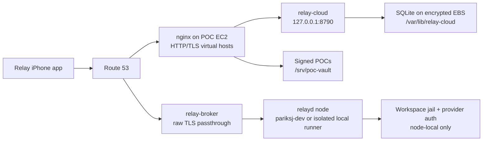

# Relay on the shared POC EC2

> Deployment design and rollout runbook. Written 2026-08-11 for the existing
> multi-application POC EC2, nginx, and Route 53 arrangement. This document is
> a plan; it does not claim that the migration or DNS cutover has happened.

## Decision

Host Relay's central backend and its database on the existing POC EC2, while
preserving the host's current applications and nginx routing.

The initial deployment should put these components on the POC EC2:

- `product/cloud` as the account, authentication, pairing, node-registry, and
  notification control plane;
- its current SQLite database on a persistent encrypted EBS-backed path;
- the static POC vault and signed manifest, if they are not already on this
  host;
- the tunnel broker once its ingress is separated from nginx HTTP traffic and
  the broker's named production blockers are closed.

Agent execution is a separate trust boundary. `relayd` or the legacy
`relay-server` runs where the workspaces and direct Codex, Claude, and Cursor
subscriptions live. For the current personal installation that remains the
isolated runner on `pariksj-dev`. A dedicated runner may also be installed on
the POC EC2, but it must be treated as a registered Relay node with its own
Unix user, home, state, and workspace jail. Provider credentials do not belong
in `relay-cloud`, the broker, nginx, or the control-plane database.

This gives “the whole backend on the POC EC2” the following precise meaning:

1. the public control plane, routing, registry, pairing, notifications, and
   control-plane database are on that EC2;
2. static POC hosting may be on the same EC2;
3. the broker may be on the same EC2 with protocol-aware ingress;
4. agent execution stays isolated as a node, even if that node is eventually
   colocated on the same machine.

The iOS application itself is built and distributed through Xcode/TestFlight;
it is not “hosted” on EC2.

## Current implementation truth

The deployment must follow the code that exists rather than describe a future
system as already available.

- `product/cloud` is a Node 22 service that normally listens on port `8790`.
- `product/cloud` currently uses `node:sqlite`; PostgreSQL support is not
  implemented. The production database for this rollout is therefore
  `/var/lib/relay-cloud/relay-cloud.sqlite`.
- The SQLite schema holds control-plane accounts, auth/session data, devices,
  nodes, entitlements, pairing rendezvous state, waitlist entries, and bounded
  node events. It does not hold prompts, source code, job output, provider
  credentials, node CA private keys, or workspace files.
- `product/cloud/deploy/install.sh` and
  `product/cloud/deploy/relay-cloud.service` already provide a release-directory
  and hardened-systemd baseline.
- `product/broker` is not an HTTP reverse-proxy service. Its client-facing leg
  passes the phone's TLS bytes through to the node, where mTLS terminates.
- The current broker spike expects a raw TLS data listener and a separate raw
  node-tunnel listener. It still lacks the finished `wss://` tunnel transport,
  registry-backed dynamic routing, reconnect/backoff, flow control, rate
  limiting, metrics, and graceful draining. It may be used for a controlled POC
  but must not be represented as beta-ready.
- The personal job API under `relay-server/` is the currently deployed direct
  runner. The newer `product/relayd` is its productized node successor. Do not
  run both against the same state directory or workspace jail.

## Target topology



Normal web hosts terminate public TLS at nginx. Tunnel data is different: TLS
must pass through unchanged and terminate at the selected Relay node. Route 53
selects an IP or AWS ingress target; it does not select a process or route by
URL path.

## DNS and service routing

Use the existing hosted zone and keep all concrete zone ids, IP addresses, and
AWS credentials outside the repository.

| Hostname shape | Route 53 target | EC2 destination | Authentication |
| --- | --- | --- | --- |
| `api.pocs.conformal.live` | Existing POC EC2 HTTP ingress | nginx -> `127.0.0.1:8790` | Public auth endpoints; bearer session for account routes |
| `codex.pocs.conformal.live` | Existing POC EC2 HTTP ingress, only if the personal runner is migrated | nginx -> private runner port `8787` | nginx mTLS plus exact subject allowlist |
| Configured vault host and POC wildcard | Existing POC EC2 HTTP ingress | nginx -> `/srv/poc-vault` | Valid client certificate |
| `*.tun.pocs.conformal.live` | Dedicated raw-TCP ingress for the broker | relay-broker data listener | End-to-end node mTLS; broker does not terminate it |
| Dedicated broker-connect host | Dedicated broker ingress | relay-broker node-tunnel listener | Node challenge/signature now; `wss://` in the production design |

Create explicit `api`, `codex`, and vault records. An existing wildcard record
must not be relied on for security or service selection. Use a low TTL during
cutover, verify the new target, then raise the TTL after the rollback window.

### Broker ingress on a shared host

nginx's HTTP layer cannot proxy the broker's current raw protocols. It also
cannot share the same IP and port if the broker binds `0.0.0.0:80` or
`0.0.0.0:443`.

The recommended low-blast-radius arrangement is:

1. keep nginx and every existing web app on the current EC2 HTTP ingress;
2. expose the broker through a dedicated TCP ingress target, such as an NLB
   forwarding to high private ports on the same EC2, or a second private
   IP/EIP bound only by the broker;
3. point the tunnel wildcard and broker-connect record at that dedicated
   ingress;
4. keep the EC2 security group limited to the exact listeners that arrangement
   requires.

An nginx `stream` SNI router is technically possible, but it would make nginx
the owner of all public port-443 connections and require every existing HTTPS
virtual host to move behind an internal TLS listener. That is a host-wide
change and should not be the first deployment on a shared POC machine.

The final broker design should replace the fingerprintable raw node-tunnel
listener with `wss://` on 443. Until that code exists, a controlled POC may use
the current separate TCP listener, but the port and limitation must be recorded
and the listener must be rate-limited at the network edge.

## Host isolation and filesystem layout

Preserve existing users, ports, nginx files, and application directories. Add
Relay with dedicated ownership:

| Path or unit | Owner | Purpose |
| --- | --- | --- |
| `/opt/relay-cloud/releases/<release-id>` | `root:root`, read-only | Immutable control-plane releases |
| `/opt/relay-cloud/current` | `root:root` symlink | Active control-plane release |
| `/etc/relay-cloud/env` | `root:relaycloud`, mode `0640` | Runtime configuration and control-plane secrets |
| `/var/lib/relay-cloud` | `relaycloud:relaycloud`, mode `0750` | SQLite database and WAL files |
| `relay-cloud.service` | runs as `relaycloud` | Control-plane process |
| broker binary/config | `root:root` plus narrow secret-readable group | Broker release and node-registry token |
| `relay-broker.service` | runs as `relaybroker` | Raw tunnel/data routing only |
| `/srv/poc-vault` | deployed by `deploy`, read by nginx | Static POCs, manifest, and signature |
| `/var/lib/relayd` and `/srv/relay-workspaces` | `relay:relay` | Optional colocated node state and workspace jail |

`relay-cloud` should bind loopback (`HOST=127.0.0.1`, `PORT=8790`) when nginx is
on the same host. Port `8790` must not be opened in the security group. The
existing installer currently derives a private host IP on first install, so
the environment must be rendered or adjusted to loopback before the shared-host
cutover.

Keep systemd hardening enabled: `NoNewPrivileges`, `ProtectSystem=strict`,
`ProtectHome`, private temporary/device namespaces, kernel/control-group
protection, and an explicit writable data directory.

## Database plan

### Initial POC database: SQLite

Use the database the application supports today:

```text
/var/lib/relay-cloud/relay-cloud.sqlite
```

Requirements:

- place `/var/lib/relay-cloud` on encrypted EBS-backed storage;
- keep the database owned only by `relaycloud`;
- retain WAL mode, which the current code enables;
- never serve the database directory through nginx or include it in a release
  artifact;
- alert on disk usage, service restart loops, SQLite I/O errors, and failed
  backups;
- size the instance and disk for the existing apps plus Relay, with headroom
  for WAL, release retention, logs, and backup staging.

The application and database are in the same failure domain. That is acceptable
for the POC, not for a high-availability product.

### Backups

Run a root-owned systemd timer or cron job that uses SQLite's online backup
operation, compresses the result, uploads it to a private versioned S3 bucket,
and removes the local staging copy. Do not copy only the main database file
while WAL writes are active.

Backup policy for the POC:

- nightly online backup;
- encrypted S3 storage with block-public-access enabled;
- a narrowly scoped EC2 instance role that can write only the backup prefix;
- retention such as 7 daily, 4 weekly, and 3 monthly copies;
- a monthly restore drill into a disposable path, followed by table counts and
  a local application health check.

Take an on-demand backup immediately before every schema-affecting release and
before any host migration.

### PostgreSQL later, not silently

Do not provision PostgreSQL and claim Relay uses it yet. The control-plane DAL
uses deliberately portable SQL, but the current runtime and Better Auth wiring
are SQLite-specific. A PostgreSQL cutover is a code and data-migration project:

1. add and test the Postgres driver/adapter for both Relay tables and Better
   Auth tables;
2. create forward and rollback migrations;
3. copy and reconcile SQLite data in a staging database;
4. run the full auth, registry, pairing, and notification suites against
   Postgres;
5. perform a write freeze, final delta migration, and verified cutover;
6. replace SQLite backups with encrypted `pg_dump` backups.

## nginx boundary

Add a dedicated HTTP virtual host for the control plane without modifying
unrelated application blocks. Its essential shape is:

```nginx
server {
    listen 443 ssl;
    server_name api.pocs.conformal.live;

    # Existing certificate-management convention goes here.
    ssl_certificate     /path/to/public/fullchain.pem;
    ssl_certificate_key /path/to/public/privkey.pem;

    client_max_body_size 128k;

    location / {
        proxy_pass http://127.0.0.1:8790;
        proxy_http_version 1.1;
        proxy_set_header Host $host;
        proxy_set_header X-Real-IP $remote_addr;
        proxy_set_header X-Forwarded-For $proxy_add_x_forwarded_for;
        proxy_set_header X-Forwarded-Proto https;
        proxy_buffering off;
        proxy_read_timeout 300s;
    }
}
```

Use the host's existing ACME/certificate convention; validate with `nginx -t`
before any reload. Add per-IP limits for unauthenticated signup, magic-link,
and waitlist routes before public exposure. Do not put the control-plane API
behind the vault's client-certificate requirement: Apple sign-in, account
creation, and pairing bootstrap need public HTTPS endpoints with their own
application authentication.

The `codex` virtual host is different. If the personal runner is moved, retain
the existing mTLS configuration and allow only the exact subjects `CN=iphone`
and `CN=parikshit-mac`. The backend must continue to re-check the forwarded
verified subject. Port `8787` remains private.

The vault virtual host also remains certificate-protected. `/healthz` may stay
public, while the manifest, signature, and POC pages require a valid client
certificate.

## Secrets and provider authentication

Generate or install secrets directly on the target host or through the
approved AWS secret path. Never put their values in source, release archives,
nginx files, deployment logs, chat, or the SQLite database.

Control-plane secret classes include:

- `SESSION_SECRET` and `BETTER_AUTH_SECRET`;
- `ADMIN_TOKEN` and `BROKER_TOKEN`, which must be distinct;
- Sign in with Apple identifiers and client-secret material;
- APNs token-signing material;
- mail transport credentials when SES is implemented.

Agent-provider auth is node-local. Keep Codex, Claude, and Cursor subscription
state under the isolated runner home. Strip `AWS_PROFILE`,
`AWS_DEFAULT_PROFILE`, `CLAUDE_AWS_PROFILE`, `CLAUDE_CODE_USE_BEDROCK`, ambient
AWS credentials, and instance-role variables from direct Claude jobs. Do not
enable Claude through Bedrock in this account. If the runner is ever migrated
from `pariksj-dev`, authenticate the provider CLIs deliberately under the new
isolated runner account; do not copy auth files into the repository or a
workspace.

## Deployment sequence

### Phase 0: inventory and rollback preparation

Perform a read-only audit before changing the EC2:

1. confirm the exact instance id, Name tag, region, EIP/private IP, OS, disk,
   and backup state;
2. capture `nginx -T`, listeners, enabled systemd units, current Route 53
   records, and security-group rules;
3. identify every existing app that owns a hostname or listener;
4. confirm at least one tested recovery path: previous nginx config, previous
   application release, current DNS targets, and EC2/EBS snapshot;
5. lower only the Relay-related DNS TTLs before cutover.

Do not change ports or routing for an existing app merely to make room for
Relay.

### Phase 1: deploy relay-cloud and SQLite without public DNS

1. Run `npm test` in `product/cloud` and record the result.
2. Package source plus `package-lock.json`, excluding local `node_modules`,
   secrets, database files, and build caches.
3. Install into a new `/opt/relay-cloud/releases/<release-id>` directory using
   Node 22 and `npm ci --omit=dev`.
4. Create `/etc/relay-cloud/env` on the EC2 with `HOST=127.0.0.1`, port `8790`,
   the persistent database path, and host-generated secrets.
5. Start `relay-cloud.service` and verify the service user, bind address,
   filesystem permissions, restart behavior, and local `/healthz`.
6. Exercise local account/auth, waitlist, admin rejection, and broker-hook
   rejection paths without logging tokens.
7. Run and upload the first database backup, then perform a disposable restore.

### Phase 2: add nginx and Route 53 for the control plane

1. Add only the `api.pocs.conformal.live` nginx virtual host.
2. Issue/install its public certificate with the host's existing method.
3. Run `nginx -t`, reload nginx, and test with a temporary local DNS override
   or `curl --resolve` before changing Route 53.
4. Create/update the Route 53 record to the existing POC EC2 HTTP ingress.
5. Verify externally over HTTPS, including security headers, body limits,
   authentication failures, and health.
6. Observe logs and error rate through the rollback window before raising TTL.

### Phase 3: static POCs and current personal runner

Deploy static POCs only through `ops/deploy-poc`. Verify that the manifest and
a representative POC are blocked without a client certificate and return 200
with the configured certificate.

Do not migrate the personal runner as a side effect of the control-plane
deployment. If it is explicitly moved later:

1. create the dedicated runner account and workspace jail on the target;
2. install either `relay-server` for current-app compatibility or `relayd` for
   the product node path, not both over the same state;
3. authenticate providers under that isolated account without AWS/Bedrock
   fallback;
4. verify every advertised provider before publishing it in the catalog;
5. cut `codex.pocs.conformal.live` only after jobs, continuation, SSE, files,
   threads, cancellation, and mTLS pass on the new host.

### Phase 4: broker POC, then production hardening

Before exposing the broker, run its Go test, race, and adversarial suites. Use
dedicated raw-TCP ingress so nginx's existing web listeners remain untouched.

The controlled POC exit gate is:

- registered node connects outbound;
- unknown node/SNI is rejected;
- phone with the correct client certificate reaches node `/healthz`;
- phone without a certificate is rejected by the node;
- SSE arrives incrementally through the tunnel;
- existing nginx-hosted apps remain healthy.

Production exposure waits for registry-backed dynamic nodes,
reconnect/backoff, authenticated `wss://` tunnel transport, flow control,
accept-time rate limits, metrics, and graceful draining.

## Verification matrix

| Area | Required evidence |
| --- | --- |
| Existing host | All pre-existing public health checks and listeners are unchanged |
| relay-cloud local | systemd active; only intended bind; local `/healthz` 200 |
| relay-cloud public | `https://api.pocs.conformal.live/healthz` 200; invalid auth rejected; no secrets in response/logs |
| Database | database persists across restart; online backup succeeds; disposable restore opens and passes integrity/application checks |
| nginx | `nginx -t` passes before reload; correct hostname routes; unrelated vhosts still pass |
| Route 53 | authoritative and independent external resolvers return the intended target |
| Static POCs | public health 200; manifest and POC blocked without cert and 200 with cert |
| Personal runner, if moved | unauthenticated API blocked; both allowed subjects pass; files/jobs/threads/SSE/providers verified |
| Broker POC | unknown routes fail closed; node mTLS enforced; incremental SSE; node reconnect behavior recorded honestly |
| iPhone | production base URLs match DNS; sign-in/pairing/node access work on Wi-Fi and cellular |

A deployment is not complete merely because a service restarted or DNS was
updated. Record the release identifier, EC2 instance, service state, database
backup object, DNS answer, public health, and authenticated end-to-end result.

## Rollback

Prepare rollback before cutover:

- keep at least one previous `/opt/relay-cloud/releases/<id>` directory;
- preserve the previous `current` symlink target and nginx config;
- keep the pre-release SQLite backup immutable;
- retain the old Route 53 target until the new service passes the observation
  window;
- never delete or overwrite the old runner state during migration.

For an application failure, point `current` back to the previous release,
restart only `relay-cloud`, and re-run local/public health. For an nginx
failure, restore the prior vhost and reload only after `nginx -t`. For a data
failure, stop writes, preserve the failed database for investigation, restore
to a new file, validate it, and then atomically update the configured path. For
a routing failure, restore the previous Route 53 record and verify resolution
from outside the EC2.

## Work required before execution

The following are implementation or live-infrastructure tasks, not completed
by this write-up:

1. inventory the actual POC EC2, nginx listeners, Route 53 records, security
   groups, and occupied resources;
2. decide the broker ingress: NLB/high private ports or a second private
   IP/EIP;
3. make the cloud installer accept an explicit loopback bind on first install
   or render `/etc/relay-cloud/env` before service start;
4. add the control-plane nginx template and scoped rate limits;
5. add the database backup/restore systemd units and monitoring;
6. finish broker registry integration, reconnect, `wss://`, flow control,
   limits, metrics, and draining before beta;
7. wire and live-test SES, APNs, and Sign in with Apple production settings;
8. choose explicitly whether the current personal runner remains on
   `pariksj-dev` or is migrated as an isolated node after the central backend
   is stable.

