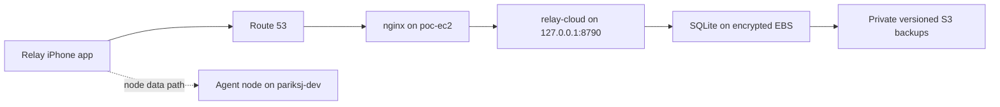

# Relay control plane on the shared POC EC2

> Live deployment record and operating runbook. Last verified 2026-08-11.

For the full implementation timeline, resource inventory, encountered
failures, dirty-worktree boundary, and next-agent checklist, read
[`RELAY_POC_EC2_AGENT_HANDOFF.md`](RELAY_POC_EC2_AGENT_HANDOFF.md).

## Deployed state

Relay's account and control-plane backend is deployed in the non-Cut AWS
account selected by the `default` CLI profile.

| Item | Live value |
| --- | --- |
| AWS account | `507121383669` |
| Region | `ap-south-1` |
| EC2 | `poc-ec2` (`i-0ce97c38c7fd74825`) |
| Public API | `https://relay.ai-rocket-experiments.com` |
| Route 53 zone | `ai-rocket-experiments.com` |
| Service | `relay-cloud.service` |
| Private listener | `127.0.0.1:8790` |
| Database | `/var/lib/relay-cloud/relay-cloud.sqlite` |
| Backup bucket/prefix | `s3://relay-poc-backups-507121383669-ap-south-1/relay-cloud/` |
| CI/CD source | CodeCommit repository `relay-cloud`, branch `main` |
| CI/CD pipeline | CodePipeline `relay-cloud-deploy` |
| Pipeline stack | CloudFormation `relay-cloud-cicd` |
| Current release | `8728c7f3b119944044b1bf1d53c9a52b481f0efd` (deployed 2026-08-13, 13:50 UTC) |
| Previous release | `263265d67b41dbaec95cda73022314f3755f2deb` — retained on disk for rollback |
| Pre-deploy recovery point | EBS snapshot `snap-0027cd41761bc9dd7`; per-deploy SQLite backups under `/var/lib/relay-cloud/relay-cloud.sqlite.bak-*` |

Both releases were deployed by invoking `product/cloud/deploy/cicd-deploy.sh`
directly (tar → private S3 → SSM → `install.sh`), **not** through
CodeCommit/CodePipeline. The SHAs are therefore GitHub `main` commits and may
not exist in the CodeCommit mirror; the next pipeline run supersedes them
cleanly because the same code is on `main`.

`8728c7f…` carries the push-notification banner change (`notify.js`
`bannerFor`). Verified on the host after the flip, not inferred from the
deploy script's own exit status: `current` → `releases/8728c7f…`, service
`active`, loopback `/healthz` `{"ok":true}`, `bannerFor` present in the running
`src/notify.js`, `latestHandoffForNode` present in both `registry.js` and
`notify.js`, no `loc-key` left on the alert path (the three remaining matches
in `apns.js` are the comment explaining why it went), and no `credentials
unset` line in the journal after the restart — the APNs `.p8` survived the
release. Release directories are content-addressed by SHA, so rollback is a
symlink flip plus `systemctl restart relay-cloud`.

The public IP is intentionally not persisted in this document. Route 53 and
the EC2 inventory are the current sources of truth.

The iOS application is not hosted on EC2. This rollout changed backend and
AWS infrastructure only; Relay was not rebuilt or installed on an iPhone.

## What was implemented

- `product/cloud` runs as a dedicated `relaycloud` user in immutable release
  directories under `/opt/relay-cloud/releases/<git-sha>`.
- `/opt/relay-cloud/current` points at the active release. The installer rolls
  back to the prior release if its local health gate fails.
- A private, SHA-256-verified Node 22 runtime lives under
  `/opt/relay-cloud/node`; the host's global Node installation and other apps
  are not changed.
- Secrets are generated on the EC2 into `/etc/relay-cloud/env`, owned by
  `root:relaycloud` with mode `0640`. Values do not enter source, CI variables,
  artifacts, or deployment output.
- nginx terminates public TLS for `relay.ai-rocket-experiments.com` and proxies
  only to `127.0.0.1:8790`. Port `8790` is not open in the security group.
- Let's Encrypt issued the public certificate. The existing certbot systemd
  timer handles renewal.
- A scoped nginx request limit and a `128k` request-body limit protect the
  control-plane vhost.
- The SQLite database is stored on the instance's encrypted EBS volume. The
  service uses `UMask=0077`, and deployment enforces mode `0600` on the database
  and its sidecar files.
- `relay-cloud-backup.timer` creates an online SQLite backup, validates
  `PRAGMA integrity_check`, compresses and checksums it, uploads it to the
  private S3 prefix, and removes old local staging files.
- The backup bucket has block-public-access, versioning, default SSE-S3
  encryption, and lifecycle rules. The instance role can access only the Relay
  backup prefix; it cannot list or write arbitrary S3 buckets.
- nginx configuration was backed up before the new virtual host was added.
  The host's existing `jisha` and `miq` nginx blocks and application services
  were left in place.

## Architecture and boundaries



The cloud service is a rendezvous and control plane. It stores accounts,
sessions, entitlements, devices, node registry data, pairing rendezvous state,
and bounded node events. It does not store prompts, job results, workspaces,
provider credentials, or node CA private keys.

Agent execution remains on the isolated runner. Direct Codex, Claude, and
Cursor subscription state stays in that runner's home. Do not set
`AWS_PROFILE`, `AWS_DEFAULT_PROFILE`, `CLAUDE_AWS_PROFILE`, or
`CLAUDE_CODE_USE_BEDROCK` for direct Claude jobs, and do not enable Claude
through Bedrock in this personal Relay account.

The raw tunnel broker was not moved onto `poc-ec2`. nginx already owns public
ports 80 and 443, while the broker still requires raw TCP ingress and has
unfinished `wss://`, flow-control, metrics, limiting, and drain work. The
separate `relay-router` spike remains untouched. This avoids breaking existing
web applications or claiming an unfinished broker path is production-ready.

Static POCs remain backend-driven and continue to deploy through
`ops/deploy-poc`; this control-plane rollout did not modify Relay's native POC
library or the existing mTLS POC perimeter.

## CI/CD flow

The CloudFormation template at
`product/cloud/deploy/relay-cloud-cicd.yml` creates the dedicated deployment
path:

```text
CodeCommit main update
  -> EventBridge trigger
  -> CodePipeline source stage
  -> CodeBuild on Node 22
  -> npm ci + full tests + script validation
  -> versioned release archive in private S3
  -> SSM AWS-RunShellScript on poc-ec2
  -> immutable install/restart/rollback gate
  -> local and public /healthz checks
```

The pipeline deploys the exact CodeCommit SHA as the release directory name.
It does not SSH to the host and requires no public deployment port. The EC2
downloads only release objects under the pipeline artifact bucket's
`releases/` prefix.

To publish a new control-plane release, update the standalone CodeCommit
repository's `main` branch. Do not push a dirty monorepo or local database into
that repository. The build excludes `node_modules`, SQLite files, and Python
caches. Deployment is complete only when CodePipeline reports `Succeeded`, the
EC2 `current` symlink matches the source SHA, and the public health endpoint is
green.

## Database and backup operations

SQLite is the database the application supports today; PostgreSQL is not
silently provisioned or claimed. The current DAL and Better Auth adapter must
be migrated and tested before any PostgreSQL cutover.

Useful target-host checks:

```bash
systemctl status relay-cloud
systemctl status relay-cloud-backup.timer
curl -fsS http://127.0.0.1:8790/healthz
sqlite3 /var/lib/relay-cloud/relay-cloud.sqlite 'PRAGMA integrity_check;'
stat -c '%a %U:%G %n' /var/lib/relay-cloud/relay-cloud.sqlite
```

Run an on-demand backup with:

```bash
sudo systemctl start relay-cloud-backup.service
sudo systemctl show relay-cloud-backup.service -p Result --value
```

Restore verification must happen in a disposable path with
`product/cloud/deploy/verify-backup.sh`; never restore over the live database
as a test.

## Verified evidence

The 2026-08-11 rollout verified:

- Route 53 resolves `relay.ai-rocket-experiments.com` to the intended POC EC2.
- Public `GET /healthz` returns `200` over HTTPS with `{"ok":true}`.
- `relay-cloud` is active and enabled, and only `127.0.0.1:8790` is listening.
- The running release symlink matches the successful pipeline SHA.
- CodeBuild's Node 22 run passed all 59 cloud tests before deployment.
- SQLite opened with 17 tables, passed `PRAGMA integrity_check`, survived a
  service restart, and is owner-only.
- The backup timer is active and enabled; an on-demand backup completed and
  uploaded to the private S3 prefix.
- nginx configuration syntax passed. Existing unrelated nginx warnings about
  duplicate `jisha` server names and certificates without OCSP responders were
  present before Relay and were not changed in this rollout.
- `nginx`, `postgresql`, `flux-gateway`, `flux`, and `miq` remained active.
- Existing listeners on 8787, 3030, and 3040 remained present.
- Unauthenticated account, admin, and broker-registry routes fail closed.

## Rollback

For an application regression, point `/opt/relay-cloud/current` to the prior
healthy release, restart only `relay-cloud`, and repeat local and public health
checks. The installer performs this rollback automatically when its health
gate fails.

For an nginx regression, restore the timestamped backup under
`/var/backups/relay-cloud/nginx/`, run `nginx -t`, then reload nginx. For a data
incident, stop writes, preserve the failed database, restore a verified backup
to a new file, then atomically switch after integrity and application checks.
For a host-level incident, use the recorded pre-deploy EBS snapshot as the
last-resort recovery point.

Do not delete or overwrite the personal runner, broker spike, existing nginx
applications, or their data as part of a Relay control-plane rollback.

## Remaining product work

- Connect and verify real APNs, mail delivery, and Sign in with Apple
  production credentials without putting keys in source or CI logs.
- Finish the broker's `wss://` ingress, reconnect behavior, flow control,
  accept-time rate limits, metrics, and graceful draining before moving it to
  shared production ingress.
- Add external uptime alerting and structured application error reporting.
- Point the iOS production account base URL at the new host, then rebuild,
  install, and exercise account, pairing, node, and cellular-network flows.
- Decide on PostgreSQL only through a tested code and data migration.
